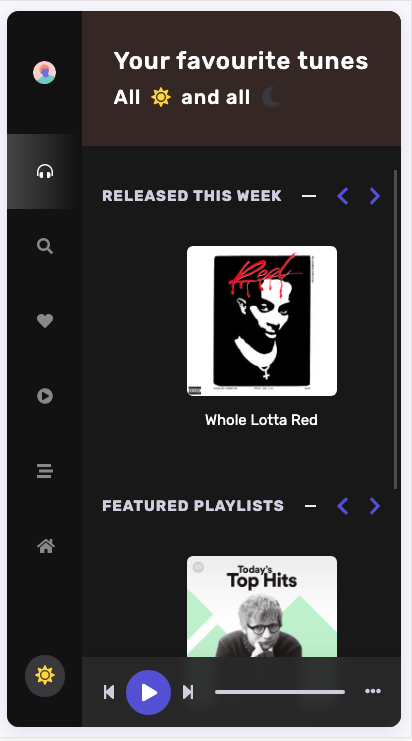

# What do we evaluate?
- Your ability to recognize the possible need for clarifications.
- Your knowledge and approach to consuming APIs and handling responses within a React app.
- Your understanding of loading state and where and how to make multiple API calls efficiently.

# Tasks
- Use the Spotify API directly in the frontend to achieve the following:
    - Fetch and display *Released This Week* songs via the API path `new-releases`.
    - Fetch and display *Featured Playlists* via the API path `featured-playlists`.
    - Fetch and display *Browse* genres via the API path `categories`.
- Show the loading state in the UI.
- Implement a Dark Mode:
    - Add a Dark Mode toggle button.
    - Use CSS classes to adjust the colors when in Dark Mode.

# Example

